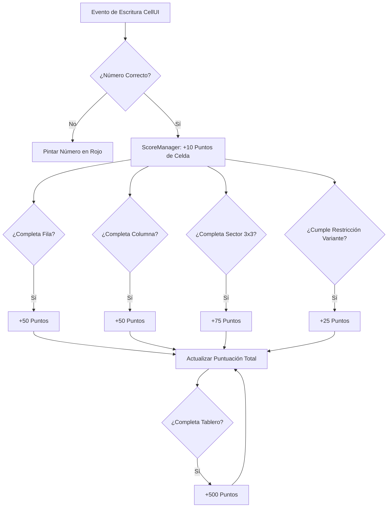
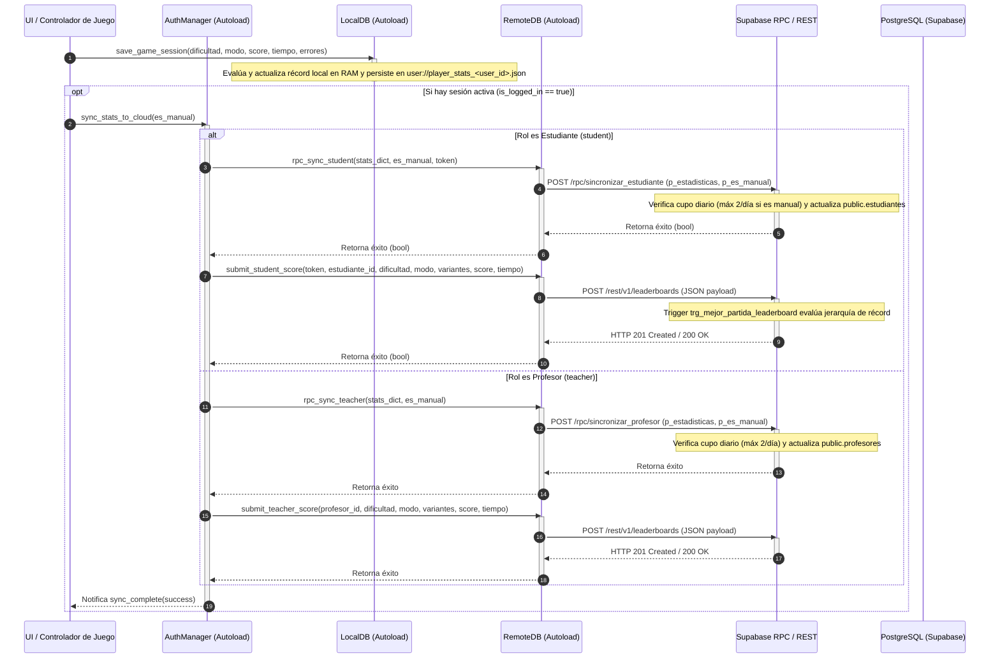

# Análisis Técnico y Guía de Arquitectura del Proyecto (Sudoku Samurai++)

Este documento sirve como especificación técnica completa y contexto para sistemas de Inteligencia Artificial y redactores académicos de tesis. Describe la arquitectura del software, los detalles algorítmicos del resolvedor/generador, el sistema de tableros solapados en cadena (Samurái Dinámico) y la persistencia local/remota.

---

## 1. Vista General y Configuración del Entorno

*   **Motor de Videojuegos:** Godot Engine v4.6 (GL Compatibility rendering).
*   **Frecuencia de Cuadros Objetivo:** 60 FPS (Fijado mediante `run/max_fps=60`).
*   **Nombre del Proyecto:** `Sudoku Samurai++` (definido temporalmente en [project.godot](file:///c:/Users/USER/Documents/godot/RLS/nuevo-proyecto-de-juego/project.godot)).
*   **Patrón de Acceso a Datos (Autoload Singletons):**
    *   `Global` ([Global.gd](file:///c:/Users/USER/Documents/godot/RLS/nuevo-proyecto-de-juego/scripts/Global.gd)): Estado dinámico del nivel en ejecución, transición de foco entre celdas y referencias activas.
    *   `LocalDB` ([LocalDB.gd](file:///c:/Users/USER/Documents/godot/RLS/nuevo-proyecto-de-juego/scripts/Database/LocalDB.gd)): Persistencia local de puntuaciones y tiempos en JSON.
    *   `RemoteDB` ([RemoteDB.gd](file:///c:/Users/USER/Documents/godot/RLS/nuevo-proyecto-de-juego/scripts/Database/RemoteDB.gd)): Integración global en la nube (Supabase REST API).
    *   `ScoreManager` ([ScoreManager.gd](file:///c:/Users/USER/Documents/godot/RLS/nuevo-proyecto-de-juego/scripts/ScoreManager.gd)): Orquestación centralizada de puntos, verificación de restricciones y logros.

---

## 2. Modelado de Sudoku como Problema de Satisfacción de Restricciones (CSP)

El motor principal del juego se encuentra en [SudokuLogic.gd](file:///c:/Users/USER/Documents/godot/RLS/nuevo-proyecto-de-juego/scripts/CoreSudoku/SudokuLogic.gd), que implementa la lógica de resolución mediante algoritmos de CSP.

### 2.1 Representación de Variables y Dominios
*   **Variables ($X$):** Las 81 coordenadas del tablero de Sudoku representadas como objetos `Vector2i(x, y)`.
*   **Dominios ($D$):** En lugar de usar arrays de enteros `[1, 2, ..., 9]` (lentos y pesados en asignación de memoria), los dominios se representan como **máscaras de bits enteras (Bitmasks)** de 9 bits.
    *   Máscara llena (valores del 1 al 9 disponibles): `511` en decimal ($2^9 - 1$ o `111111111` en binario).
    *   Conversión de valor a bitmask: $1 \ll (\text{value} - 1)$.
    *   **Optimización del conteo de bits (MRV heuristic):** Se inicializa una tabla de búsqueda (LUT - Lookup Table) `bit_counts_lut` de 512 elementos en `_init()` para realizar el conteo de opciones disponibles en $O(1)$ mediante indexación directa, evitando bucles iterativos.

### 2.2 Estructura y Red de Restricciones
*   **Red de Restricciones Estándar:** Construida en `_build_constraint_network()`. Cada variable $v$ mapea a un array de "vecinos" (celdas en la misma fila, columna o bloque de $3 \times 3$).
*   **Variantes Dinámicas Implementadas:**
    1.  **Anti-Knight (Anti-Caballo):** Celdas que se encuentran a una distancia de movimiento de caballo de ajedrez no pueden contener el mismo valor. Los offsets de movimiento `KNIGHT_MOVES` se agregan directamente a la red de restricciones de vecinos si `use_knight_constraint` es `true`.
    2.  **Killer Sudoku:** Grupos de celdas delimitados por jaulas (`killer_cages`) que deben sumar un valor exacto sin repetir dígitos.
    3.  **Thermo Sudoku:** Líneas continuas de celdas (`thermo_chains`) donde los dígitos deben ser estrictamente crecientes desde el bulbo hasta el extremo.
    4.  **Arrow Sudoku:** Células que componen un círculo (`arrow_constraints`) cuyo valor debe ser igual a la suma exacta de las celdas situadas a lo largo de su flecha/eje.

### 2.3 Algoritmo de Propagación de Restricciones (AC-3)
El método `_ac3_propagation()` implementa el algoritmo Arc Consistency 3 (AC-3):
*   **Optimización de Memoria (Evitar Reasignación de Arrays):** En lugar de llamar a `pop_front()` (lo cual desplaza todos los elementos del array de cola en memoria e induce latencia en GDScript), se utiliza un array plano de enteros indexado mediante un cursor de lectura (`head`) que avanza de 2 en 2, incrementando el rendimiento en un orden de magnitud.
*   **Revisión de Arcos:** `_revise(Xi, Xj)` verifica la consistencia entre dominios. Si el dominio del vecino $Xj$ tiene un solo valor posible (máscara con un solo bit encendido), dicho valor es removido del dominio de $Xi$ mediante operaciones a nivel de bit: `domains[Xi] & ~mask_x_j`.

### 2.4 Poda de Dominios para Variantes (Pre-AC-3)
Antes de ejecutar la propagación estándar, el método `_prune_variant_domains()` reduce drásticamente el espacio de búsqueda basándose en cotas matemáticas estrictas:
*   **Termómetros:** Para un termómetro de longitud $n$, el elemento en la posición de índice $i$ (base 0) tiene acotado su valor mínimo a $i + 1$ y su valor máximo a $9 - (n - 1 - i)$. Los valores fuera de estas cotas son purgados a nivel de bitmask en $O(1)$.
*   **Jaulas Killer:** Para una jaula de tamaño $n$ y suma objetivo $S$, se calcula en $O(1)$ la suma mínima y máxima que pueden tener las $n - 1$ celdas restantes. Si para un valor $v$ en la celda evaluada, $v + \text{min\_others} > S$ o $v + \text{max\_others} < S$, el bit correspondiente a $v$ se limpia en el dominio.

### 2.5 Búsqueda con Retroceso (Backtracking Search)
*   **Heurística de Ordenamiento:** Utiliza la heurística de valor remanente mínimo (**MRV - Minimum Remaining Values**) en `_get_best_variable()` seleccionando la variable con el dominio de menor tamaño disponible.
*   Si una variable tiene una sola opción en su dominio, se retorna inmediatamente evitando llamadas de ramificación redundantes.
*   **Límite de pasos:** Implementa una salvaguarda de seguridad `step_resolve > 5000` para evitar bucles infinitos en tableros no resolubles.

---

> [!NOTE]
> **Evolución y Justificación Académica del Solver:**
> Durante la investigación inicial de métodos de resolución y generación de Sudokus, se evaluó el algoritmo **Dancing Links (DLX)** de Donald Knuth (diseñado para problemas de cobertura exacta). DLX demostró un rendimiento óptimo al resolver Sudokus clásicos de 9x9. Sin embargo, al incorporar restricciones no estándar (como sumas Killer, gradientes Thermo o movimientos de caballo), la reformulación matemática de la matriz de cobertura exacta incrementó la complejidad lógica de forma insostenible, forzando su descarte.
>
> Como consecuencia, se diseñó un modelo híbrido: se mantiene la estructura básica de **Backtracking** como motor de resolución de último recurso, pero se le dota de una capa inteligente de optimización. Esta inteligencia se implementa mediante la combinación de **AC-3 (Arc Consistency 3)** para la poda activa de arcos inconsistentes en los dominios, la heurística **MRV (Minimum Remaining Values)** para reducir la ramificación del árbol de decisión, y reglas específicas de reducción de cotas matemáticas para variantes antes de cada búsqueda.

---

## 3. Generación y Excavación de Puzzles (SudokuGenerator.gd)

El archivo [SudokuGenerator.gd](file:///c:/Users/USER/Documents/godot/RLS/nuevo-proyecto-de-juego/scripts/CoreSudoku/SudokuGenerator.gd) implementa las fases de creación de tableros únicos y la excavación controlada de pistas.

### 3.1 Fase 1: Creación del Tablero Resuelto
1.  Si se genera un tablero independiente (Caso 1), se inicializa la primera fila con un array barajado aleatoriamente del 1 al 9 y se llama a `solver.solve()`.
2.  Si es un tablero encadenado (Caso 2), se hereda una esquina semilla (3x3) resuelta del tablero anterior que actúa como restricción fija inamovible (ver Sección 4).

### 3.2 Fase 2: Generación Procedimental de Restricciones
Si el nivel requiere variantes y no hay configuraciones manuales inyectadas, el generador crea restricciones coherentes con la solución matemática obtenida en la Fase 1:
*   **Killer Cages:** Divide aleatoriamente el tablero excluyendo la zona de intersección con el tablero de entrada. Utiliza un algoritmo BFS aleatorio para agrupar celdas adyacentes de tamaño 2 a 4 garantizando que no se repitan dígitos dentro del grupo.
*   **Thermo Chains:** Selecciona puntos de inicio y avanza espacialmente hacia celdas adyacentes si su valor en la solución es estrictamente mayor que el anterior, creando caminos crecientes de longitud 3 a 5.
*   **Arrow Constraints:** Selecciona un círculo inicial con valor $\ge 3$ y utiliza búsqueda en profundidad (**DFS**) (`_find_arrow_shaft_path`) para encontrar un camino no cruzado de celdas cuyas soluciones sumen exactamente el valor del círculo.

### 3.3 Fase 3: Excavación Controlada
El método `_excavate_board()` remueve números progresivamente garantizando la **unicidad de la solución**:
*   **Blindaje de Esquina (Corner Shielding):** Las posiciones que correspondan al área de solape recibida del tablero predecesor (`seed_grid`) **no pueden ser excavadas**. Deben permanecer intactas para no romper la transición e interconexión lógica de la cadena de tableros.
*   **Evaluación de Unicidad y Dificultad:** Por cada celda candidata a ser excavada, se limpia temporalmente su bit en el dominio de búsqueda con el valor correcto original y se ejecuta el resolvedor. Si encuentra una solución alternativa, se deshace la excavación para preservar la solución única.
*   **Métrica de Dificultad Híbrida (Backtracking + Vacíos):** Al introducir variantes, AC-3 suele resolver tableros con restricciones estructurales puras (0 pistas numéricas) sin recurrir al backtracking. Por ende, la métrica híbrida considera tanto los backtracks como la cantidad total de pistas eliminadas. Un menor número de pistas (mayor número de celdas vacías) incrementa de manera inherente la exigencia lógica del tablero, permitiendo a la vez diferenciar las dificultades extremas.
    *   **Fácil:** 40-45 vacíos (se reduce si hay variantes activas), 0 backtracks.
    *   **Medio:** 48-53 vacíos (se reduce con variantes), máximo 50 backtracks.
    *   **Difícil:** 55-62 vacíos (se reduce con variantes), hasta 1000 backtracks.
    *   **Extremo:** Hasta 81 vacíos (0 pistas), donde las variantes asumen todo el peso de las restricciones lógicas.

---

> [!NOTE]
> **Flexibilización del Límite de Excavación con Variantes:**
> Históricamente, el límite de excavación se fijó en 62 celdas vacías porque en un Sudoku clásico el mínimo teórico de pistas es de 17, y aproximarse a ese límite causaba una explosión combinatoria inestable.
>
> Sin embargo, la integración estructural **a priori** de restricciones de variantes (Killer, Thermo, Arrow) suprime de manera determinista enormes espacios de búsqueda en el AC-3. Esta optimización permite rebajar el umbral mínimo drásticamente. De manera experimental y teórica, el generador ahora está habilitado para superar las 64 celdas vacías, llegando hasta niveles donde la cantidad de pistas numéricas es de 0 (81 celdas vacías) en el modo Extremo, logrando una unicidad matemática sustentada enteramente en la lógica estructural geométrica añadida.

---

## 4. Sistema Samurái en Cadena Progresiva y Solapamientos

La mecánica de interconexión de tableros está controlada por el [SamuraiManager.gd](file:///c:/Users/USER/Documents/godot/RLS/nuevo-proyecto-de-juego/scripts/Board/SamuraiManager.gd).

### 4.1 Geometría y Posicionamiento en Zigzag
*   Los tableros están posicionados en una cuadrícula lógica 2D representada por coordenadas vectoriales `board_grid_positions`.
*   El tamaño visual de cada tablero es de $9 \times \text{CELL\_SIZE} = 576\text{px}$.
*   El tamaño de la zona de solape es de $3 \times \text{CELL\_SIZE} = 192\text{px}$ (un bloque sectorial de $3 \times 3$).
*   La distancia de desfase (offset) entre tableros consecutivos es:
    $$\text{CHAIN\_OFFSET} = \text{BOARD\_SIZE} - \text{OVERLAP\_SIZE} = 384\text{px}$$
*   Esto posiciona físicamente a los tableros solapados en sus esquinas de forma perfecta.

### 4.2 Lógica de Transición y Mapeo de Esquinas
Cuando un tablero se completa, se define una esquina de salida (`ExitCorner`) para proyectar el siguiente. El método `get_seed_for_next_floor()` extrae el bloque de $3 \times 3$ de la esquina y realiza una traducción matemática de sus coordenadas locales:

| Dirección de Salida (ExitCorner) | Coordenadas Fuente en Tablero Previo | Coordenadas Destino en Tablero Nuevo | Fórmulas de Offset Aplicadas |
| :--- | :--- | :--- | :--- |
| **TOP_RIGHT** | X: 6..8, Y: 0..2 | X: 0..2, Y: 6..8 | $\Delta x = -6$, $\Delta y = 6$ |
| **BOTTOM_RIGHT** | X: 6..8, Y: 6..8 | X: 0..2, Y: 0..2 | $\Delta x = -6$, $\Delta y = -6$ |
| **TOP_LEFT** | X: 0..2, Y: 0..2 | X: 6..8, Y: 6..8 | $\Delta x = 6$, $\Delta y = 6$ |
| **BOTTOM_LEFT** | X: 0..2, Y: 6..8 | X: 6..8, Y: 0..2 | $\Delta x = 6$, $\Delta y = -6$ |

### 4.3 Evitación de Colisiones Físicas
El crecimiento dinámico de la cadena podría causar que un tablero nuevo se solape visual y lógicamente con un tablero antiguo ya resuelto. Para evitarlo:
*   `_get_valid_candidate_corners()` comprueba todas las posibles esquinas de salida desde el último tablero.
*   `_is_position_valid()` verifica que las coordenadas de cuadrícula lógica del nuevo tablero tengan una distancia Manhattan $> 1$ respecto a **todos** los tableros anteriores generados (excluyendo al predecesor directo con el que colisiona intencionadamente). Si hay colisión, esa esquina es descartada.

### 4.4 Generación Asíncrona Multihilo
Para evitar caídas de fotogramas (stuttering) durante la fase de excavación del siguiente tablero en tiempo de juego:
*   Se instancia un objeto `Thread` en el hilo principal.
*   Se ejecuta el método `_thread_generate_board()` en segundo plano sin bloquear el SceneTree.
*   **Esquema de Fallbacks (Tiers de Generación):**
    *   **Tier 1:** Intenta generar el tablero con las variantes deseadas en las esquinas válidas libres de colisión.
    *   **Tier 2:** Si falla tras `MAX_GENERATION_ATTEMPTS`, reintenta desactivando variantes y forzando modo clásico (`CLASSIC`) en las esquinas válidas.
    *   **Tier 3 (Emergencia):** Si falla, ignora la comprobación de colisión física e instancia un Sudoku clásico en la dirección por defecto para evitar un bloqueo del flujo de juego.
*   Al concluir, se comunica con el hilo principal mediante `call_deferred("_on_generation_completed", ...)`.

### 4.5 Vinculación Bidireccional de Celdas (Shared Cells)
El método `_link_shared_cells()` conecta físicamente las instancias de `CellUI` ([cellv_2.gd](file:///c:/Users/USER/Documents/godot/RLS/nuevo-proyecto-de-juego/scripts/Board/cellv_2.gd)) del bloque de solape:
*   Almacenan una referencia cruzada: `linked_cell = other_cell`.
*   **Evitación de bucles infinitos de actualización:** Cuando el jugador escribe un número, la celda emite su verificación e invoca a `linked_cell.set_value_from_link(number)`. Ambas celdas utilizan una bandera booleana local `_syncing` como semáforo lógico. Si `_syncing` es `true`, se aborta la propagación circular de eventos.

---

> [!NOTE]
> **Porcentaje de Desbloqueo del Siguiente Tablero:**
> En el código fuente, la comprobación en `_should_spawn_next_board()` se encuentra configurada en un umbral del 20% (`get_solved_percentage() > 0.2`). Este valor bajo es una configuración temporal de pruebas empleada para agilizar el debugging de la generación masiva de tableros. En la versión final de producción del juego, este valor se ajustará a un rango del 70% al 80% para asegurar que el jugador complete la mayor parte del tablero actual antes de avanzar, pero permitiendo a su vez un margen razonable de concurrencia y exploración.

---

## 5. Sistema de Puntuación e Integración de Reglas de Juego (ScoreManager.gd)

El [ScoreManager.gd](file:///c:/Users/USER/Documents/godot/RLS/nuevo-proyecto-de-juego/scripts/ScoreManager.gd) funciona como un árbitro en tiempo real:

*   **Validación de Variantes en Tiempo Real:** En `_check_variant_constraint()`, comprueba si la celda resuelta posee alguna restricción de variante activa en el tablero. Por ejemplo, en el caso de *Anti-Knight*, otorga 25 puntos adicionales si el número colocado coincide con el número restringido del nivel.

---

## 6. Persistencia de Datos e Integración Cloud API (Supabase)

La persistencia de registros es híbrida y segmentada por usuario: almacena localmente los datos de juego en archivos JSON cifrados por perfil activo e integra una base de datos relacional multi-inquilino en Supabase con seguridad estricta RLS y autenticación diferenciada.

### 6.1 Autenticación Diferenciada y Mitigación de Fuerza Bruta
La plataforma implementa dos flujos de autenticación diferenciados según el rol del usuario:
1.  **Personal de Gestión (Instituciones y Profesores):** Autenticación estándar basada en correo y contraseña a través del servicio nativo **GoTrue** de Supabase Auth. Los profesores cuentan con una contraseña temporal generada por la institución en su registro y un flag `temp_password = true` que fuerza el cambio obligatorio mediante la función `cambiar_contrasena_profesor` antes de poder habilitar el juego.
2.  **Estudiantes:** Autenticación ligera sin cuenta en Supabase Auth, utilizando su nombre de usuario único y un PIN de 6 dígitos numéricos. Se invoca la función RPC `login_estudiante(p_usuario, p_pin)`.
    -   *Control de Fuerza Bruta (Lockout):* El sistema rastrea los intentos fallidos a nivel de base de datos (`intentos_fallidos` en la tabla `estudiantes`) y en el cliente (`auth_lockouts.cfg`). Si un estudiante acumula 5 intentos fallidos consecutivos, la cuenta se bloquea temporalmente estableciendo `bloqueado_hasta = now() + 1 minute`. Una vez desbloqueada o tras iniciar sesión correctamente, el contador se resetea a cero.
    -   *Sesiones de Estudiante:* Al iniciar sesión con éxito, la RPC genera de forma segura un token UUID en `sesiones_estudiantes` que expira en 24 horas y lo devuelve al cliente. Este token viaja en la cabecera HTTP personalizada `x-student-token` para autorizar las peticiones RLS del alumno.

### 6.2 Sincronización Manual Limitada y Automática
Para evitar la sobrecarga y abuso del servidor, la sincronización de perfiles en la nube está regulada por las funciones `sincronizar_estudiante` y `sincronizar_profesor`:
-   **Sincronización Manual:** Solicitada activamente por el usuario desde la UI. El sistema comprueba mediante un filtro de fecha (`ultima_sincronizacion::date = current_date`) que el usuario no haya excedido el límite diario de 2 sincronizaciones manuales.
-   **Sincronización Automática:** Realizada de forma silenciosa por el motor lúdico al cerrar la sesión o cambiar de perfil (`es_manual = false`). Estas llamadas no incrementan el contador diario y se ejecutan sin restricciones para garantizar que no se pierdan datos de juego locales.

### 6.3 Seguridad Relacional mediante Row Level Security (RLS)
La base de datos relacional de Supabase tiene habilitado de forma estricta el control RLS en todas sus tablas en producción. Las políticas de acceso se definen de la siguiente manera:
-   `instituciones`: Lectura y escritura exclusiva si `id = auth.uid()`.
-   `profesores`: Select para el profesor (`id = auth.uid()`) o su institución (`institucion_id = auth.uid()`). Gestión completa exclusiva para la institución.
-   `grupos`: Select para la institución propietaria o el profesor encargado. Gestión completa (CRUD) exclusiva de la institución.
-   `estudiantes`: Select para el estudiante (mediante la función `get_current_student_id()` que resuelve el token UUID de la cabecera `x-student-token`), su profesor encargado o su institución. Inserción y actualización restringidas a profesor e institución.
-   `sesiones_estudiantes`: Lectura denegada para cualquier usuario ajeno al estudiante asociado al token.
-   `leaderboards`: Select estructurado según rol: los estudiantes solo ven el ranking de sus compañeros de grupo; los profesores ven a los estudiantes de sus grupos y a los profesores de su institución; las instituciones tienen visibilidad total. Inserción permitida individualmente y actualización gestionada por el trigger `trg_mejor_partida_leaderboard` para garantizar un único registro por jugador.

---

## 7. Pruebas y Rendimiento Algorítmico (test_intensivo.gd)

El script [test_intensivo.gd](file:///c:/Users/USER/Documents/godot/RLS/nuevo-proyecto-de-juego/scripts/test_intensivo.gd) es una herramienta de testeo y perfilado (profiling) automatizado:
*   **Metodología:** Genera de forma masiva tableros variando los parámetros de dificultad inicial desde un valor mínimo hasta un valor máximo configurables, registrando el tiempo de ejecución en milisegundos (`Time.get_ticks_msec()`).
*   **Utilidad en la Tesis:** Estos logs de tiempos de ejecución y pasos de backtracking proporcionan los datos empíricos necesarios para construir tablas y gráficos estadísticos de rendimiento algorítmico, demostrando la estabilidad temporal del resolvedor CSP optimizado por bitmasks.
