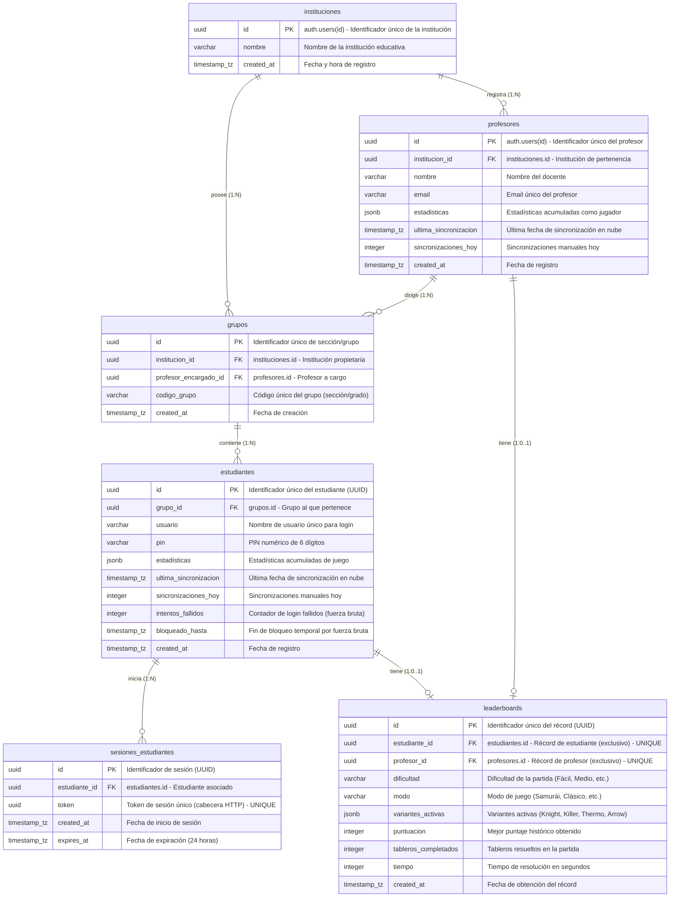
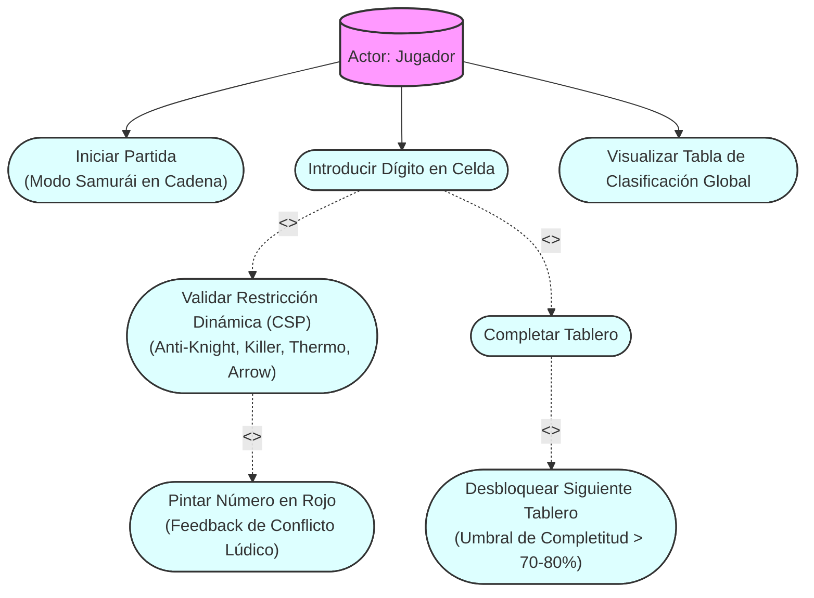
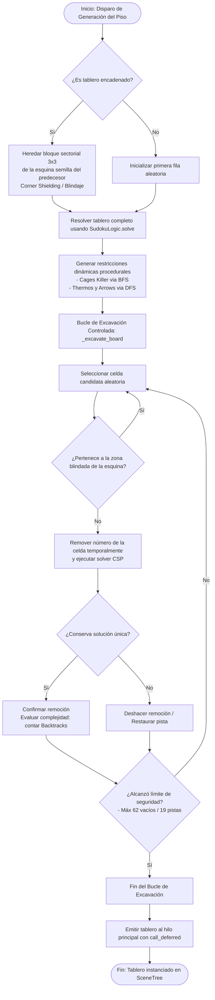
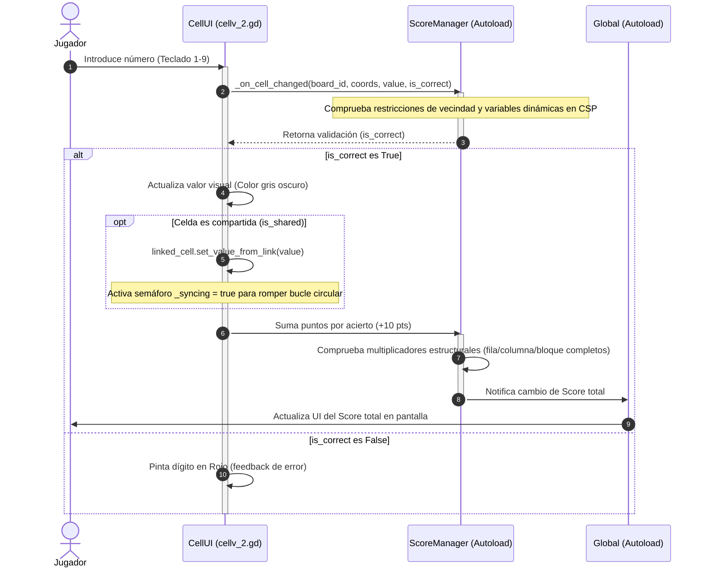
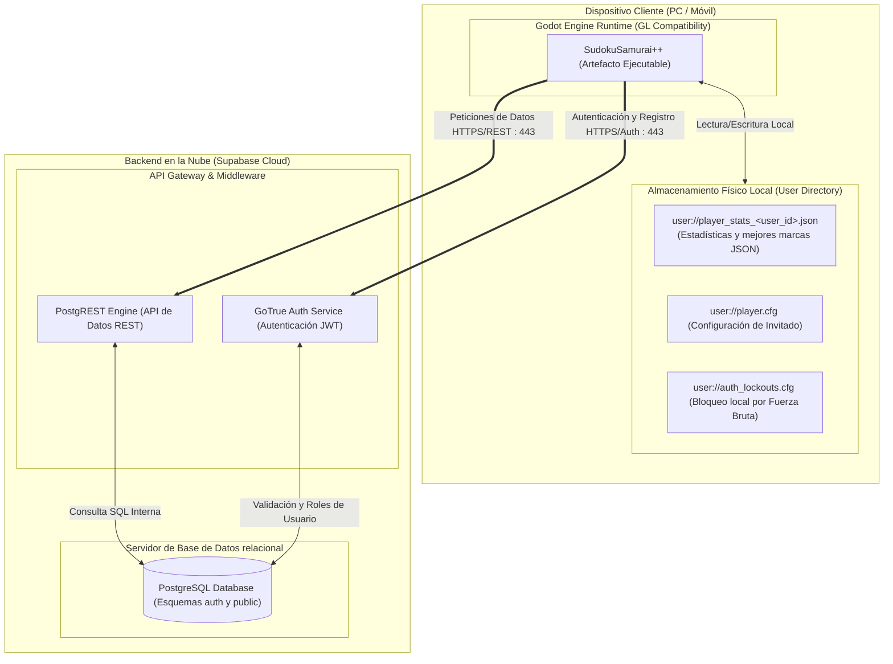

# Documentación Gráfica de Arquitectura: Proyecto "Sudoku Samurai++"

Este documento contiene las especificaciones formales y el código fuente en formato Mermaid.js para los 7 diagramas arquitectónicos del videojuego. Cada diagrama está rotulado bajo formato institucional, optimizado para su inclusión en la tesis.

---

## 1. Diagrama Entidad-Relación (DER / Modelo de Datos)

### TÍTULO: DIAGRAMA DE MODELO DE DATOS Y PERSISTENCIA (DER)

### FUENTE: Elaboración propia del autor (2026).

*   **Explicación de Datos:** El modelo de datos v2 estructura la persistencia relacional en Supabase para dar soporte al entorno escolar multirrol. `instituciones` y `profesores` enlazan 1:1 con la tabla interna de usuarios de Supabase (`auth.users`), controlando sus permisos de inserción y lectura de forma directa. Los `estudiantes` no usan Supabase Auth, sino usuario y PIN de 6 dígitos validados mediante RPC de base de datos (`login_estudiante`), el cual genera un token en `sesiones_estudiantes` que expira en 24 horas para validar políticas RLS en la sesión del cliente. La tabla `leaderboards` almacena los récords de partidas mediante relaciones de exclusión de un único poseedor por fila, controlado a través de un trigger BEFORE INSERT (`evaluar_mejor_partida`) que actualiza la puntuación si esta es superior bajo jerarquía de puntuación, tableros y tiempo. En local, `LocalDB.gd` persiste los datos acumulados y runs en formato JSON bajo archivos dinámicos aislados por usuario (`user://player_stats_<user_id>.json`).

---

## 2. Diagrama de Casos de Uso (UML)

### TÍTULO: DIAGRAMA DE CASOS DE USO Y LÍMITES DEL SISTEMA

### FUENTE: Elaboración propia del autor (2026).

*   **Explicación de Casos de Uso:** El caso de uso principal "Introducir Dígito" invoca de manera forzada (`<<include>>`) la validación del motor CSP. En caso de que el valor no pertenezca a la solución consistente, se extiende el flujo (`<<extend>>`) para pintar la celda en rojo. La resolución paulatina extiende el flujo a "Completar Tablero", lo cual desencadena la verificación del umbral para instanciar asíncronamente el siguiente tablero de la cadena.

---

## 3. Diagrama de Componentes (UML)

### TÍTULO: DIAGRAMA DE COMPONENTES DE SOFTWARE Y DEPENDENCIAS
```mermaid
graph TB
    subgraph UI ["Capa de Interfaz de Usuario (SceneTree Nodes)"]
        CellUI["cellv_2.gd (Celda Visual)"]
        BoardUI["tablero_v_3.gd (Tablero Visual)"]
        LeaderboardUI["leaderboard.gd (Ranking Visual)"]
        SchoolMgmtUI["UI de Gestión Escolar"]
    end

    subgraph Core ["Cálculo y Resolución Algorítmica (CSP)"]
        SudokuLogic["SudokuLogic.gd (Resolvedor y Poda AC-3)"]
        SudokuGenerator["SudokuGenerator.gd (Motor de Excavación)"]
    end

    subgraph Singletons ["Orquestación y Flujo Lúdico (Autoloads)"]
        Global["Global.gd (Estado General y Foco)"]
        ScoreManager["ScoreManager.gd (Puntajes y Arbitraje)"]
        AuthManager["AuthManager.gd (Gestor de Sesión)"]
    end

    subgraph Persistence ["Capa de Persistencia de Datos"]
        LocalDB["LocalDB.gd (JSON local cifrado por usuario)"]
        subgraph RemoteFacade ["Módulo Remoto (Fachada Supabase)"]
            RemoteDB["RemoteDB.gd (Controlador de Red HTTP)"]
            RemoteAuth["RemoteAuth.gd (Autenticación RPC / GoTrue)"]
            RemoteSync["RemoteSync.gd (Sincronización de Perfiles)"]
            RemoteLeaderboard["RemoteLeaderboard.gd (Ranking Global)"]
            RemoteCrud["RemoteCrud.gd (Gestión Escolar)"]
        end
    end

    subgraph External ["Servicios Cloud de Terceros"]
        Supabase["Supabase Cloud (API REST PostgREST / GoTrue Auth)"]
    end

    %% Relaciones y Dependencias
    CellUI -->|Consulta Foco| Global
    BoardUI -->|Registra Tablero| ScoreManager
    CellUI -->|Notifica Cambio de Celda| ScoreManager
    LeaderboardUI -->|Solicita Listado| RemoteLeaderboard
    SchoolMgmtUI -->|Llamadas de CRUD| RemoteCrud
    
    SudokuGenerator -->|Resuelve / Evalúa Unicidad| SudokuLogic
    BoardUI -.->|Instancia Datos de Puzzle| SudokuGenerator
    
    ScoreManager -->|Registra Sesión| LocalDB
    ScoreManager -->|Sube Puntuación| RemoteLeaderboard
    
    AuthManager -->|Inicializa Perfil / Sincroniza| LocalDB
    AuthManager -->|Peticiones de Acceso| RemoteAuth
    AuthManager -->|Ordena Sync de Datos| RemoteSync
    
    RemoteDB -->|Delegación de Llamadas| RemoteAuth & RemoteSync & RemoteLeaderboard & RemoteCrud
    RemoteDB -->|HTTPS/REST (Puerto 443)| Supabase
```
### FUENTE: Elaboración propia del autor (2026).

*   **Explicación de Componentes:** El diseño desacopla la vista de Godot (UI Layer) del resolvedor de restricciones (Core Solvers). La coordinación de flujos de datos en el cliente se realiza a través de los administradores globales (Singletons/Autoloads) añadiendo a `AuthManager.gd` para la gestión escolar y de logins. La persistencia remota adopta un patrón **Fachada (Facade)** en `RemoteDB.gd` que delega las operaciones HTTP especializadas a `RemoteAuth.gd`, `RemoteSync.gd`, `RemoteLeaderboard.gd` y `RemoteCrud.gd`, separando la persistencia offline (`LocalDB.gd` con estadísticas JSON segmentadas por usuario) de la online en Supabase.

---

## 4. Diagrama de Actividades (UML)

### TÍTULO: DIAGRAMA DE ACTIVIDADES PARA LA GENERACIÓN Y EXCAVACIÓN DE PUZZLES

### FUENTE: Elaboración propia del autor (2026).

*   **Explicación de Actividades:** Este diagrama modela el algoritmo del generador en segundo plano. La decisión crítica es el blindaje de la esquina (Corner Shielding), que previene que la zona de solape pierda pistas resueltas, asegurando que la interconexión entre tableros no se corrompa en el proceso de excavación.

---

## 5. Diagrama de Secuencia (UML)

### TÍTULO: DIAGRAMA DE SECUENCIA PARA VALIDACIÓN Y PUNTUACIÓN EN TIEMPO REAL

### FUENTE: Elaboración propia del autor (2026).

*   **Explicación de Secuencia:** Modela la cronología de eventos cuando una celda recibe una entrada numérica. La sincronización lateral con la celda compartida (`linked_cell`) es bidireccional y se ejecuta inmediatamente de forma asíncrona, usando el semáforo `_syncing = true` para evitar desbordamientos de pila por recursividad cíclica.

---

## 6. Diagrama de Despliegue (UML)

### TÍTULO: DIAGRAMA DE DESPLIEGUE ARQUITECTÓNICO FÍSICO Y RED

### FUENTE: Elaboración propia del autor (2026).

*   **Explicación de Despliegue:** Mapea el entorno físico de ejecución y la topología de red. La comunicación externa se realiza desde el cliente Godot directamente hacia Supabase Cloud sobre HTTPS (puerto 443). El cliente interactúa con **GoTrue Auth** para iniciar sesión como docente/institución y con **PostgREST** para persistir datos y ejecutar RPCs de estudiante o de sincronización. A nivel local, los archivos de almacenamiento persistente (`user://`) se aíslan por usuario para permitir la compartición del dispositivo entre múltiples estudiantes sin conflicto de datos.

---

## 7. Diagrama Esquemático (No UML)

### TÍTULO: DIAGRAMA ESQUEMÁTICO DEL SISTEMA SAMURÁI DINÁMICO Y GEOMETRÍA DE SOLAPE
```mermaid
graph LR
    subgraph Tablero1 ["Tablero N (Predecesor)"]
        direction TB
        Grid1["Cuadrícula 9x9"]
        Exit1["Sector Solapado de Salida (3x3)<br>(p.ej., TOP_RIGHT)"]
        Grid1 -.-> Exit1
    end

    subgraph Overlap ["Zona de Solapamiento Físico (Coincidencia 3x3)"]
        SharedCells["9 Celdas Compartidas en Pantalla<br>(cell.link_to)"]
    end

    subgraph Tablero2 ["Tablero N+1 (Sucesor)"]
        direction TB
        Entrance2["Sector Solapado de Entrada (3x3)<br>(p.ej., BOTTOM_LEFT)"]
        Grid2["Cuadrícula 9x9"]
        Entrance2 -.-> Grid2
    end

    %% Transición Geométrica
    Exit1 ===|Coincide con| SharedCells
    SharedCells ===|Coincide con| Entrance2

    %% Desplazamiento Vectorial
    Tablero1 ===>|Desfase Matemático: CHAIN_OFFSET = 384px| Tablero2

    %% Leyenda
    Note[Visualización:<br>Ancho de Tablero: 576px (9 celdas)<br>Ancho de Solape: 192px (3 celdas)<br>Offset de Cadena = 576px - 192px = 384px]
```
### FUENTE: Elaboración propia del autor (2026).

*   **Explicación Esquemática:** Ilustración geométrica de la coincidencia física y traslación matemática de coordenadas locales entre el Tablero N (Salida) y el Tablero N+1 (Entrada). El desplazamiento de renderizado se calcula restando el área de coincidencia del ancho total del tablero, guiado por la dirección de solape seleccionada.
