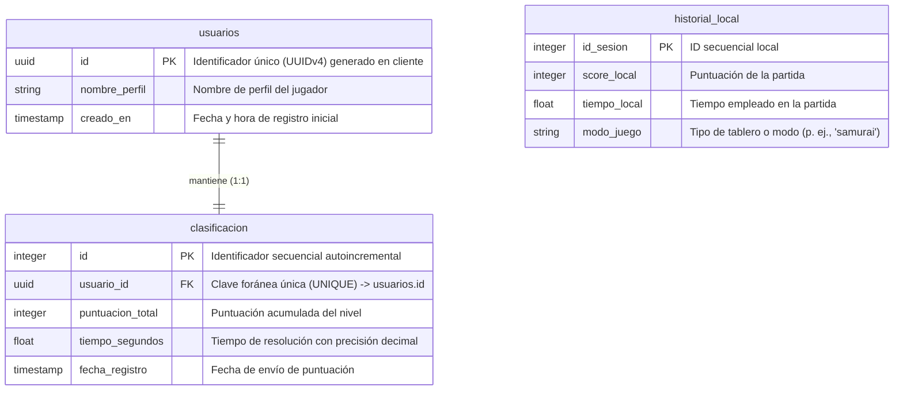
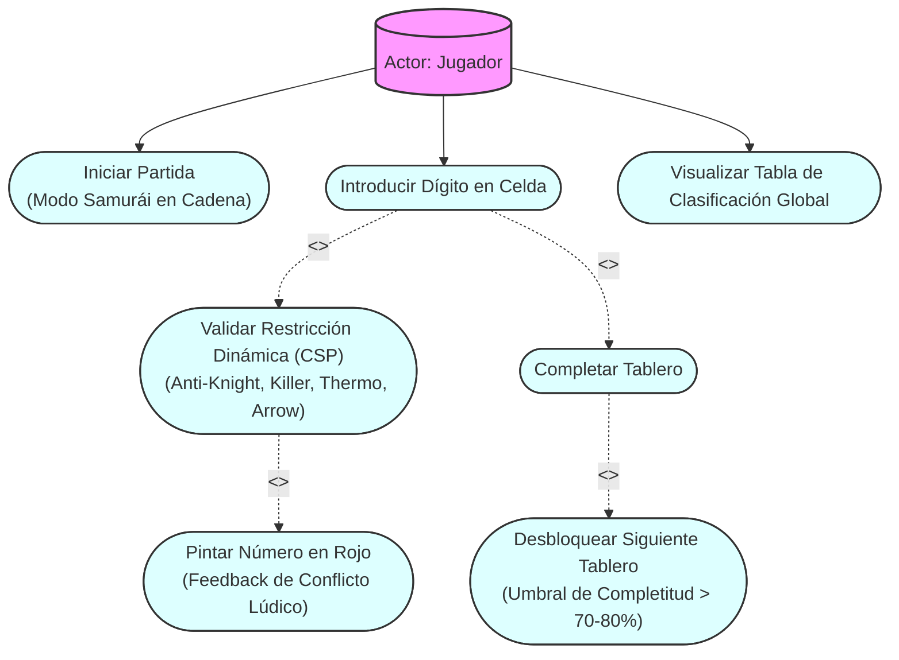
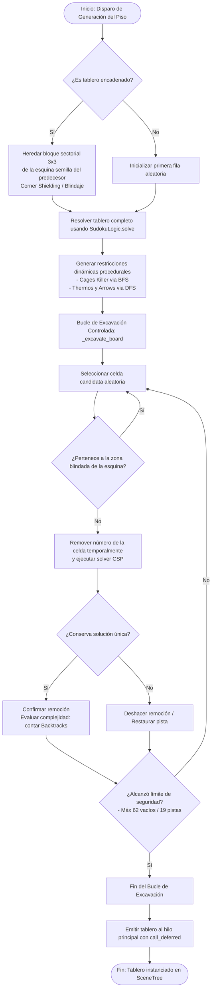
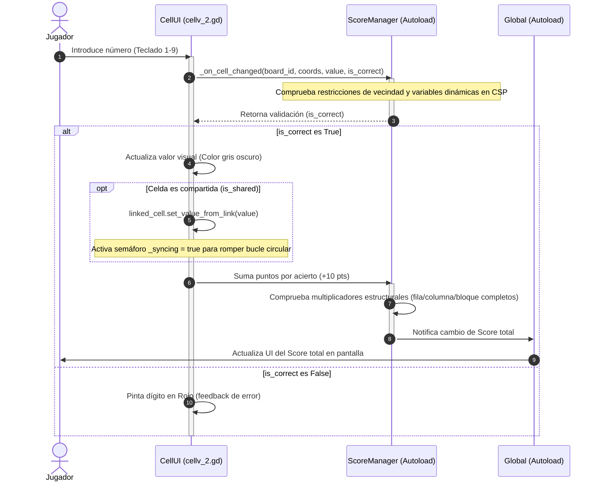
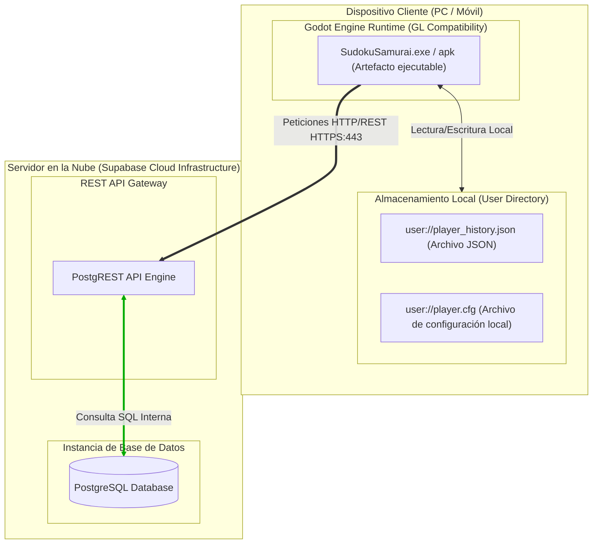

# Documentación Gráfica de Arquitectura: Proyecto "Sudoku Samurai++"

Este documento contiene las especificaciones formales y el código fuente en formato Mermaid.js para los 7 diagramas arquitectónicos del videojuego. Cada diagrama está rotulado bajo formato institucional, optimizado para su inclusión en la tesis.

---

## 1. Diagrama Entidad-Relación (DER / Modelo de Datos)

### TÍTULO: DIAGRAMA DE MODELO DE DATOS Y PERSISTENCIA (DER)

### FUENTE: Elaboración propia del autor (2026).

*   **Explicación de Datos:** La relación entre `usuarios` y `clasificacion` es estricta de 1 a 1 (`UNIQUE` en `usuario_id`). Esto fuerza a nivel de persistencia en Supabase (PostgreSQL) que cada jugador solo tenga una única entrada de clasificación con su mejor marca de puntuación general. El `historial_local` es un almacenamiento plano desconectado en JSON serializado en local (`user://player_history.json`).

---

## 2. Diagrama de Casos de Uso (UML)

### TÍTULO: DIAGRAMA DE CASOS DE USO Y LÍMITES DEL SISTEMA

### FUENTE: Elaboración propia del autor (2026).

*   **Explicación de Casos de Uso:** El caso de uso principal "Introducir Dígito" invoca de manera forzada (`<<include>>`) la validación del motor CSP. En caso de que el valor no pertenezca a la solución consistente, se extiende el flujo (`<<extend>>`) para pintar la celda en rojo. La resolución paulatina extiende el flujo a "Completar Tablero", lo cual desencadena la verificación del umbral para instanciar asíncronamente el siguiente tablero de la cadena.

---

## 3. Diagrama de Componentes (UML)

### TÍTULO: DIAGRAMA DE COMPONENTES DE SOFTWARE Y DEPENDENCIAS
```mermaid
graph TB
    subgraph UI ["UI Layer (SceneTree Nodes)"]
        CellUI["cellv_2.gd (Visual Cell)"]
        BoardUI["tablero_v_3.gd (Tablero Visual)"]
        LeaderboardUI["leaderboard.gd (Paginador Visual)"]
    end

    subgraph Core ["Core Solvers (Mecanismos Lógicos)"]
        SudokuLogic["SudokuLogic.gd (CSP Solver & Pruner)"]
        SudokuGenerator["SudokuGenerator.gd (Excavator Engine)"]
    end

    subgraph Singletons ["Orchestration Singletons (Autoloads)"]
        Global["Global.gd (Foco y Transiciones)"]
        ScoreManager["ScoreManager.gd (Gestión de Puntos)"]
    end

    subgraph Persistence ["Persistence Layer"]
        LocalDB["LocalDB.gd (JSON local)"]
        RemoteDB["RemoteDB.gd (HTTP REST Client)"]
    end

    subgraph External ["Servicios Cloud Externos"]
        Supabase["Supabase Cloud (PostgREST API)"]
    end

    %% Relaciones y Dependencias
    CellUI -->|Consulta Foco| Global
    BoardUI -->|Registra Tablero| ScoreManager
    CellUI -->|Notifica Cambio de Celda| ScoreManager
    LeaderboardUI -->|Solicita Listado| RemoteDB
    
    SudokuGenerator -->|Resuelve / Evalúa Unicidad| SudokuLogic
    BoardUI -.->|Instancia Datos de Puzzle| SudokuGenerator
    
    ScoreManager -->|Guarda Partida| LocalDB
    ScoreManager -->|Sube Puntuación| RemoteDB
    RemoteDB -->|HTTPS/REST Request (Port 443)| Supabase
```
### FUENTE: Elaboración propia del autor (2026).

*   **Explicación de Componentes:** El desacoplamiento separa la vista de Godot (UI Layer) de la lógica pura sin estado (Core Solvers). Los singletons globales actúan como mediadores para gestionar el flujo de datos lúdicos (ScoreManager) y de control visual (Global). La persistencia se encapsula y abstrae para permitir la coexistencia de bases de datos offline (JSON) y online (Supabase REST endpoint).

---

## 4. Diagrama de Actividades (UML)

### TÍTULO: DIAGRAMA DE ACTIVIDADES PARA LA GENERACIÓN Y EXCAVACIÓN DE PUZZLES

### FUENTE: Elaboración propia del autor (2026).

*   **Explicación de Actividades:** Este diagrama modela el algoritmo del generador en segundo plano. La decisión crítica es el blindaje de la esquina (Corner Shielding), que previene que la zona de solape pierda pistas resueltas, asegurando que la interconexión entre tableros no se corrompa en el proceso de excavación.

---

## 5. Diagrama de Secuencia (UML)

### TÍTULO: DIAGRAMA DE SECUENCIA PARA VALIDACIÓN Y PUNTUACIÓN EN TIEMPO REAL

### FUENTE: Elaboración propia del autor (2026).

*   **Explicación de Secuencia:** Modela la cronología de eventos cuando una celda recibe una entrada numérica. La sincronización lateral con la celda compartida (`linked_cell`) es bidireccional y se ejecuta inmediatamente de forma asíncrona, usando el semáforo `_syncing = true` para evitar desbordamientos de pila por recursividad cíclica.

---

## 6. Diagrama de Despliegue (UML)

### TÍTULO: DIAGRAMA DE DESPLIEGUE ARQUITECTÓNICO FÍSICO Y RED

### FUENTE: Elaboración propia del autor (2026).

*   **Explicación de Despliegue:** Mapea el entorno físico de ejecución. La comunicación en red se realiza directamente desde el cliente Godot hacia la infraestructura Supabase Cloud a través del puerto seguro HTTPS 443 utilizando PostgREST, lo cual permite persistir los datos de clasificación directamente desde el motor de videojuego sin un backend intermedio personalizado.

---

## 7. Diagrama Esquemático (No UML)

### TÍTULO: DIAGRAMA ESQUEMÁTICO DEL SISTEMA SAMURÁI DINÁMICO Y GEOMETRÍA DE SOLAPE
```mermaid
graph LR
    subgraph Tablero1 ["Tablero N (Predecesor)"]
        direction TB
        Grid1["Cuadrícula 9x9"]
        Exit1["Sector Solapado de Salida (3x3)<br>(p.ej., TOP_RIGHT)"]
        Grid1 -.-> Exit1
    end

    subgraph Overlap ["Zona de Solapamiento Físico (Coincidencia 3x3)"]
        SharedCells["9 Celdas Compartidas en Pantalla<br>(cell.link_to)"]
    end

    subgraph Tablero2 ["Tablero N+1 (Sucesor)"]
        direction TB
        Entrance2["Sector Solapado de Entrada (3x3)<br>(p.ej., BOTTOM_LEFT)"]
        Grid2["Cuadrícula 9x9"]
        Entrance2 -.-> Grid2
    end

    %% Transición Geométrica
    Exit1 ===|Coincide con| SharedCells
    SharedCells ===|Coincide con| Entrance2

    %% Desplazamiento Vectorial
    Tablero1 ===>|Desfase Matemático: CHAIN_OFFSET = 384px| Tablero2

    %% Leyenda
    Note[Visualización:<br>Ancho de Tablero: 576px (9 celdas)<br>Ancho de Solape: 192px (3 celdas)<br>Offset de Cadena = 576px - 192px = 384px]
```
### FUENTE: Elaboración propia del autor (2026).

*   **Explicación Esquemática:** Ilustración geométrica de la coincidencia física y traslación matemática de coordenadas locales entre el Tablero N (Salida) y el Tablero N+1 (Entrada). El desplazamiento de renderizado se calcula restando el área de coincidencia del ancho total del tablero, guiado por la dirección de solape seleccionada.
