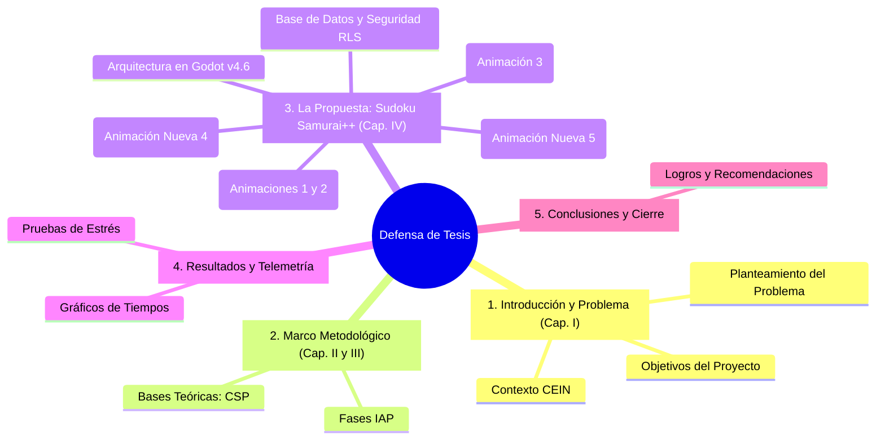

# Estructura y Guión de Presentación: Sudoku Samurai++

Esta guía proporciona una estructura formal y un guión secuencial para defender tu tesis ante el jurado, alineada con los estándares de la UPTAI. Incluye la integración de tus animaciones de **Manim** actuales y propuestas de nuevas visualizaciones para maximizar el impacto de la defensa.

---

## Estructura General de las Diapositivas

---

## Guión Paso a Paso e Integración de Animaciones

### Diapositiva 1: Portada y Presentación
*   **Título:** Plataforma Educativa de Gamificación Adaptativa para el Fortalecimiento Lógico-Matemático: *Sudoku Samurai++*.
*   **Contenido:** Nombre del autor, tutor y logotipos institucionales (IUTAI/UPTAI).
*   **Mensaje del Orador:** Saludo formal al jurado. Breve introducción sobre el propósito de utilizar el diseño de software de alto rendimiento y la Inteligencia Artificial Clásica aplicada a la educación cognitiva básica.

### Diapositiva 2: Contexto y Diagnóstico (Capítulo I)
*   **Título:** Diagnóstico Participativo (IAP) en la Comunidad.
*   **Contenido:**
    *   **Escenario:** CEIN Belén San Juan Colina (Táchira).
    *   **Necesidad:** Dificultad para motivar la resolución de problemas lógicos complejos y falta de herramientas didácticas digitales que se adapten al ritmo del estudiante.
*   **Mensaje del Orador:** Explicar cómo la investigación nace de un diagnóstico real en el aula y de la necesidad detectada de entrenar habilidades cognitivas abstractas en los niños.

### Diapositiva 3: Objetivos del Proyecto
*   **Título:** Objetivos de la Investigación.
*   **Contenido:**
    *   **General:** Desarrollar el videojuego adaptativo multiplataforma *Sudoku Samurai++*.
    *   **Específicos:** Diseñar el resolvedor CSP/AC-3, programar la interconexión de tableros Samurái, implementar la base de datos remota con RLS en Supabase y validar el rendimiento algorítmico.

---

### Diapositiva 4: Marco Conceptual: Sudoku como CSP (Capítulo II)
*   **Título:** Modelado del Problema de Satisfacción de Restricciones (CSP).
*   **Contenido:**
    *   **Variables ($X$):** Coordenadas vectoriales en la cuadrícula ($9 \times 9 = 81$ por tablero).
    *   **Dominios ($D$):** Máscaras de bits de 9 bits (`511` decimal) para alta eficiencia.
    *   **Restricciones ($C$):** Desigualdad en fila, columna y caja, además de variantes (Knight, Killer, Thermo, Arrow).
*   **Acción Multimedia:** **REPRODUCIR ANIMACIÓN 1 (`CSPNetworkConstruction`)**
*   **Mensaje del Orador:** *"Para evitar que la computadora adivine por fuerza bruta, modelamos matemáticamente el Sudoku como un CSP. Miren cómo definimos las celdas como variables, cómo las opciones iniciales del 1 al 9 forman el dominio, y cómo los arcos de restricciones conectan las celdas adyacentes asegurando que ningún número se repita."*

---

### Diapositiva 5: Consistencia de Arcos: Algoritmo AC-3
*   **Título:** Deducción Inteligente mediante Poda Activa.
*   **Contenido:**
    *   Optimización AC-3 para reducir el espacio de búsqueda antes de ramificar.
    *   Poda a nivel de bitmasks en $O(1)$ usando tablas de búsqueda (LUT).
*   **Acción Multimedia:** **REPRODUCIR ANIMACIÓN 2 (`AC3Propagation`)**
*   **Mensaje del Orador:** *"El verdadero cerebro de la IA es la propagación de restricciones con AC-3. En lugar de probar números al azar, el sistema analiza el impacto lógico de colocar un dígito. Como ven en la animación, al evaluar $V_{4,6}$, se eliminan instantáneamente los números presentes en sus vecinos (2, 4 y 7), reduciendo su dominio y propagando esa restricción en una onda de choque a toda la red para provocar un descarte deductivo en cadena."*

---

### Diapositiva 6: Búsqueda con Retroceso (Backtracking) y MRV
*   **Título:** Búsqueda Sistemática Bajo Puntos de Control.
*   **Contenido:**
    *   **Heurística MRV:** Seleccionar la variable con menor cantidad de opciones disponibles para fallar lo más rápido posible (*Fail-Fast*).
    *   Almacenamiento de snapshots de memoria en la pila del resolvedor.
*   **Acción Multimedia:** **REPRODUCIR ANIMACIÓN 3 (`BacktrackingSearch`)**
*   **Mensaje del Orador:** *"Cuando la deducción no es suficiente, la IA ramifica de forma controlada. Usando la heurística MRV, selecciona la celda más restringida para minimizar errores. Si introduce un número tentativo y detecta una contradicción en un vecino (dominio vacío), la pantalla hace un flashback, revierte al punto de control guardado en la pila de memoria (backtrack) y continúa con la siguiente opción válida, asegurando la resolución sin bloqueos."*

---

### Diapositiva 7: La Mecánica del Samurái Dinámico
*   **Título:** Geometría de Solapamiento e Interconexión de Tableros.
*   **Contenido:**
    *   Desfase vectorial constante: $\text{CHAIN\_OFFSET} = 384\text{px}$.
    *   Vinculación física bidireccional de celdas compartidas (bloque sectorial de $3 \times 3$).
    *   Semáforo lógico `_syncing` para impedir bucles de actualización infinitos.
*   **Acción Multimedia:** **REPRODUCIR ANIMACIÓN NUEVA 4 (Propuesta: Overlap & Sincronización)**
*   **Mensaje del Orador:** *"La propuesta Samurái Dinámico se basa en desplazar en zigzag los tableros. Al completarse un umbral de resolución, el sistema toma la esquina de salida del tablero anterior como la semilla inamovible del siguiente. Miren cómo el vector de traslación proyecta el nuevo cuadrante y cómo el semáforo lógico sincroniza en tiempo real los valores en ambas celdas del bloque de solape."*

---

### Diapositiva 8: Excavación Controlada y Blindaje de Esquinas
*   **Título:** Generación de Tableros con Solución Única.
*   **Contenido:**
    *   **Blindaje de Esquina (Corner Shielding):** Prohibición física de excavar las celdas del bloque semilla heredado del tablero predecesor.
    *   Bucle iterativo de comprobación de unicidad matemática.
*   **Acción Multimedia:** **REPRODUCIR ANIMACIÓN NUEVA 5 (Propuesta: Excavación & Shielding)**
*   **Mensaje del Orador:** *"Para garantizar que la cadena de tableros sea consistente, implementamos el blindaje de esquina. La zona de solape actúa como un escudo inalterable que previene que el generador remueva pistas clave. Al remover números en otras celdas, el resolvedor comprueba en milisegundos que no se generen soluciones alternativas, asegurando la unicidad matemática del rompecabezas."*

---

### Diapositiva 9: Arquitectura de Persistencia y Seguridad (Supabase v2)
*   **Título:** Infraestructura Cloud Segura y Control Escolar.
*   **Contenido:**
    *   Persistencia local aislada por usuario (`user://player_stats_<user_id>.json`).
    *   Autenticación escolar en la nube: GoTrue para directivos/docentes, custom PIN RPC para alumnos.
    *   Row Level Security (RLS) activo para aislamiento estricto de rankings y datos escolares.
*   **Mensaje del Orador:** *"La plataforma implementa una persistencia relacional robusta. Para proteger la privacidad, aplicamos Row Level Security (RLS). Los estudiantes solo ven a su sección escolar y su ranking respectivo, los profesores administran sus aulas, y las estadísticas locales se aíslan por usuario en disco, posibilitando que las tabletas escolares sean compartidas de forma segura por múltiples niños en el aula."*

---

### Diapositiva 10: Pruebas de Estrés y Telemetría Algorítmica (Resultados)
*   **Título:** Benchmarking e Instrumentos de Telemetría.
*   **Contenido:**
    *   Medición empírica con `test_intensivo.gd`.
    *   **Resultados:** Tiempo medio de resolución en CPU < 10ms en modo clásico, estabilidad multihilo a 60 FPS estables sin tirones gráficos (*stuttering*).
*   **Mensaje del Orador:** *"Mediante pruebas automáticas de miles de tableros, demostramos empíricamente la estabilidad temporal de la solución. El resolvedor AC-3 podó el espacio tan eficazmente que en modo fácil no requirió retrocesos y resolvió en menos de 8.4 milisegundos de CPU, logrando una fluidez constante en el hilo principal."*

---

### Diapositiva 11: Conclusiones y Recomendaciones
*   **Título:** Logros del Proyecto y Trabajo Futuro.
*   **Contenido:**
    *   **Logros:** IA de alto rendimiento en Godot Engine, persistencia robusta y segura con RLS, impacto pedagógico en estimulación cognitiva.
    *   **Recomendaciones:** Expandir las variantes lúdicas y exportar la telemetría a un panel web escolar avanzado para seguimiento analítico docente.
*   **Mensaje del Orador:** Conclusiones formales, agradecimiento al jurado e inicio del ciclo de preguntas.

---

## Nuevas Animaciones Recomendadas con Manim

Para que tu presentación sea completamente insuperable y aclare los dos hitos técnicos más complejos y originales de tu desarrollo, te sugiero programar dos animaciones adicionales:

### Animación 4: "Samurái Dinámico: Solape y Sincronización"
*   **Visuales en Manim:**
    1.  Dibuja una cuadrícula de Sudoku de $9 \times 9$ en la izquierda representando el "Tablero N".
    2.  Resalta su bloque de la esquina inferior derecha ($3 \times 3$) pintándolo en un tono azul translúcido.
    3.  Muestra un vector (flecha animada) que nace del origen del Tablero N y se desplaza hacia abajo y a la derecha con una etiqueta: $\vec{d} = (384, -384)\text{px}$.
    4.  Dibuja un segundo tablero ("Tablero N+1") que aparece en el destino de la flecha, solapándose exactamente sobre el bloque azul.
    5.  Coloca un "8" en la celda del solape del Tablero N. Muestra una línea de enlace tipo rayo o cable de datos conectándola con su celda homóloga en el Tablero N+1, ilustrando el semáforo `_syncing` encendiéndose para evitar la propagación recursiva infinita al replicar el valor instantáneamente en el otro extremo.

### Animación 5: "Excavación y Blindaje (Corner Shielding)"
*   **Visuales en Manim:**
    1.  Dibuja una cuadrícula llena (resuelta) de Sudoku.
    2.  Pinta las 9 celdas del bloque de solape de la esquina con un contorno dorado brillante y un icono de candado o escudo.
    3.  Muestra un cursor cursor selector (puntero de color rojo) que simula el algoritmo excavador barriendo celdas.
    4.  Cuando el cursor toca una celda dorada (área de solape), aparece una alerta de "Prohibido / Zona Blindada" en rojo y el cursor retrocede sin alterar el número.
    5.  Cuando el cursor toca una celda fuera de la zona blindada, remueve el número, el resolvedor CSP hace un destello de verificación de unicidad verde, y la celda queda vacía de forma permanente.
    6.  Si cae en una celda donde la remoción rompe la unicidad de solución, se muestra un aviso de error en rojo y el número es restaurado, demostrando el control de pistas en acción.
